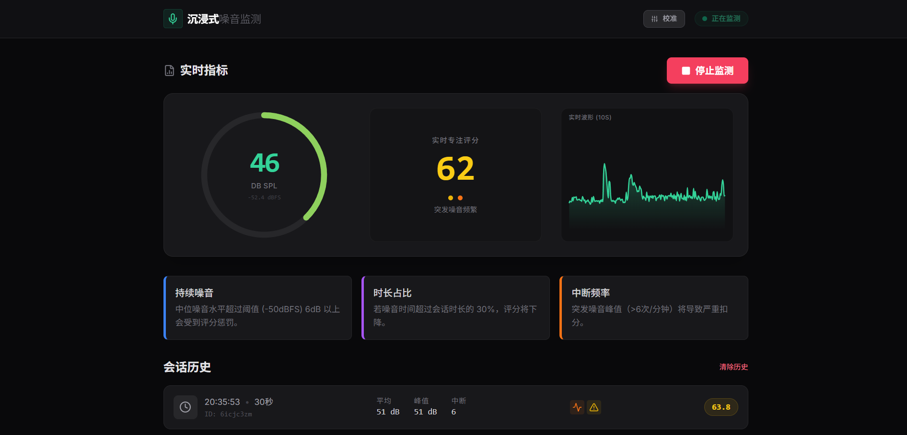
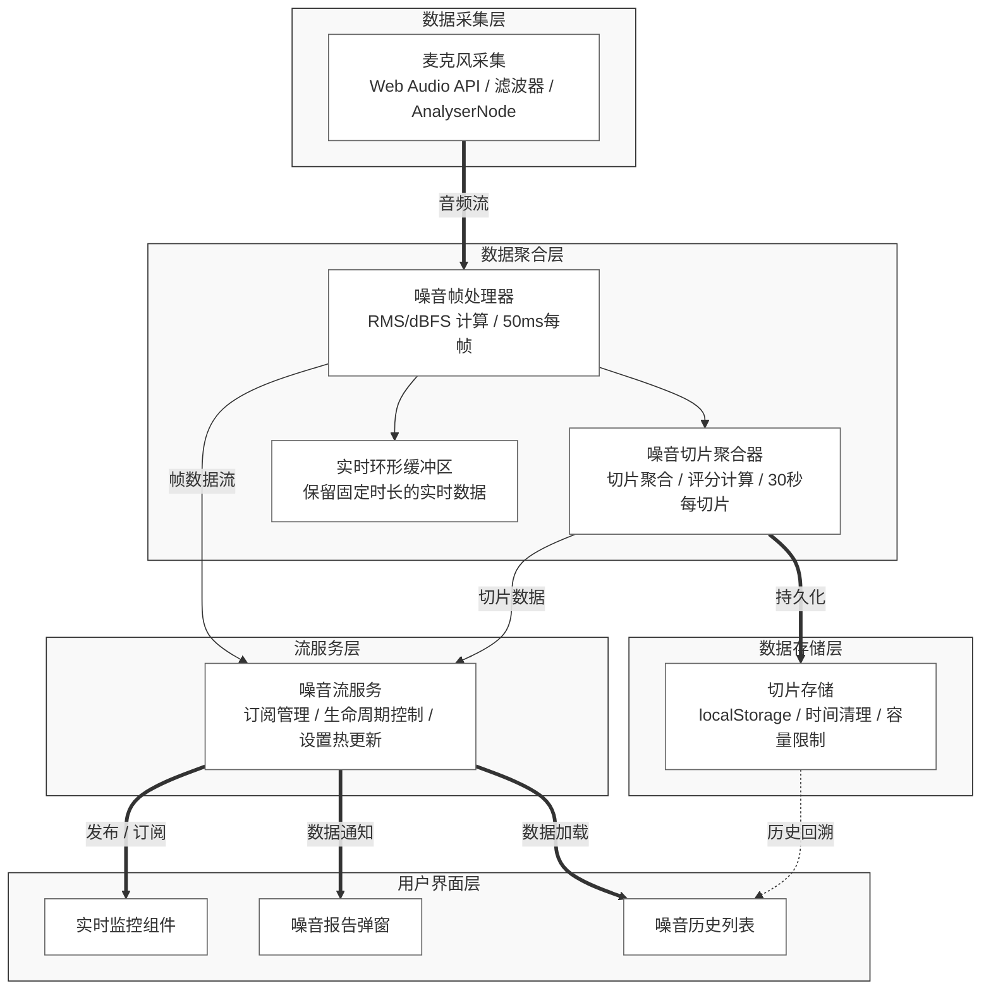

<h1 align="center">
  <br/>
  
  <br/>
  沉浸式噪音监测
</h1>

<p align="center">
  专注于公开沉浸式时钟独特的噪音监测与评分算法
</p>

> 沉浸式时钟 [Immersive Clock](https://github.com/QQHKX/Immersive-clock) 的衍生作品。

## 📊 界面预览

<div align="center">
  
</div>

## 项目简介

本项目从 [沉浸式时钟](https://github.com/QQHKX/Immersive-clock) 项目中提取并独立了噪音监测模块，旨在公开其基于心理声学与专注力理论的噪音评分引擎。该算法不仅仅是一个简单的分贝计，而是通过多维度加权扣分制，客观量化环境噪音对学习心流的干扰程度。

## 核心特性

### 三维度评分模型

噪音评分系统从三个维度对环境噪音进行评估：

| 维度 | 权重 | 指标 | 满扣分条件 |
|------|------|------|-----------|
| **持续噪音** | 40% | p50Dbfs | 中位数超过阈值 6 dBFS |
| **超阈时长** | 30% | overRatioDbfs | 超阈时间占比 30% |
| **打断频次** | 30% | segmentCount | 6 次/分钟 |

### 评分与校准分离

- **评分只依赖原始 DBFS**：评分的三项核心指标都来自原始 `dbfs` 统计，与校准无关
- **校准仅影响显示分贝**：校准值只用于 UI 展示，不进入评分链路
- 杜绝了通过调整校准值"刷分"的可能性

### 智能事件段合并

系统设有 500ms 的合并窗口，如果两次响声间隔小于该窗口（如拉椅子的一连串声音），会被合并为 1 次打断，只有间隔较长的响声才会被计为新的打断。

## 技术架构



## 快速开始

### 安装依赖

```bash
cnpm install
```

### 启动开发服务器

```bash
cnpm run dev
```

### 构建生产版本

```bash
cnpm run build
```

## 技术栈

| 技术组件 | 版本/方案 |
|---------|----------|
| **前端框架** | React 19 |
| **构建工具** | Vite 6 |
| **类型系统** | TypeScript 5.8 |
| **图表库** | Recharts 3 |
| **音频处理** | Web Audio API |
| **数据存储** | localStorage |

## 核心算法说明

### RMS（均方根）计算

$$ \text{RMS} = \sqrt{\frac{1}{N} \sum_{i=1}^{N} x_i^2} $$

### dBFS（分贝满刻度）转换

$$ \text{dBFS} = 20 \times \log_{10}(\text{RMS}) $$

### 评分公式

$$ \text{TotalPenalty} = 0.40 \times P_{\text{sustained}} + 0.30 \times P_{\text{time}} + 0.30 \times P_{\text{segment}} $$

$$ \text{Score} = 100 \times (1 - \text{TotalPenalty}) $$

## 详细技术文档

完整的噪音计算与评分技术文档请参考 [noise-technical.md](./noise-technical.md)，其中包含：

- 核心理念与设计原则
- 系统架构详解
- 数据采集层实现
- 数据聚合层算法
- 评分算法核心
- 数据存储策略
- 历史报告生成
- 流服务整合
- 配置参数体系
- 完整类型定义

## 功能对比与实现状态

### 项目定位

**沉浸式时钟**：一个现代化的全屏时钟应用，支持时钟、倒计时、秒表与晚自习模式，内置天气、噪音提醒及噪音走势图、励志语录、课程表管理。

**本项目（沉浸式噪音监测）**：沉浸式时钟的衍生作品，专注于公开其独特的噪音监测与评分算法，移除了其他功能模块。

### 功能对比表

| 功能模块 | 沉浸式时钟 | 本项目 | 实现状态 | 说明 |
|---------|------------|--------|---------|------|
| **时间管理** | | | | |
| 时钟显示 | ✅ | ❌ | 未实现 | 本项目专注于噪音监测，不包含时钟功能 |
| 倒计时 | ✅ | ❌ | 未实现 | 本项目专注于噪音监测，不包含倒计时功能 |
| 秒表 | ✅ | ❌ | 未实现 | 本项目专注于噪音监测，不包含秒表功能 |
| 自习模式 | ✅ | ❌ | 未实现 | 本项目专注于噪音监测，不包含自习模式 |
| 多目标倒计时轮播 | ✅ | ❌ | 未实现 | 本项目专注于噪音监测，不包含倒计时轮播功能 |
| **环境感知** | | | | |
| 实时天气 | ✅ | ❌ | 未实现 | 本项目专注于噪音监测，不包含天气功能 |
| 分钟级降水预警 | ✅ | ❌ | 未实现 | 本项目专注于噪音监测，不包含天气预警功能 |
| 气象灾害预警 | ✅ | ❌ | 未实现 | 本项目专注于噪音监测，不包含气象预警功能 |
| **噪音监测** | | | | |
| 实时噪音监测 | ✅ | ✅ | 已实现 | 50ms 采样率，基于 Web Audio API |
| RMS/dBFS 计算 | ✅ | ✅ | 已实现 | 完整的音频信号处理链路 |
| 音频滤波器 | ✅ | ✅ | 已实现 | 高通 80Hz，低通 8000Hz |
| 三维度评分引擎 | ✅ | ✅ | 已实现 | 持续噪音、超阈时长、打断频次 |
| 实时评分显示 | ✅ | ✅ | 已实现 | 实时计算并显示评分 |
| 噪音历史记录 | ✅ | ✅ | 已实现 | LocalStorage 持久化，保留 14 天 |
| 噪音校准功能 | ✅ | ✅ | 已实现 | 3 秒校准，支持自定义基准分贝 |
| 实时波形图表 | ✅ | ✅ | 已实现 | 使用 Recharts 绘制 10 秒波形 |
| 评分与校准分离 | ✅ | ✅ | 已实现 | 评分只依赖原始 dBFS，校准仅影响显示 |
| 课表关联的历史报告 | ✅ | ❌ | 未实现 | 本项目不包含课表功能 |
| **专注氛围** | | | | |
| 励志语录 | ✅ | ❌ | 未实现 | 本项目专注于噪音监测，不包含语录功能 |
| 多频道源支持 | ✅ | ❌ | 未实现 | 本项目专注于噪音监测，不包含语录功能 |
| 组件开关 | ✅ | ❌ | 未实现 | 本项目专注于噪音监测，不包含组件开关 |
| 背景定制 | ✅ | ❌ | 未实现 | 本项目专注于噪音监测，不包含背景定制 |
| 自定义字体 | ✅ | ❌ | 未实现 | 本项目专注于噪音监测，不包含字体定制 |
| 课表导入 | ✅ | ❌ | 未实现 | 本项目专注于噪音监测，不包含课表功能 |
| **性能与体验** | | | | |
| PWA 支持 | ✅ | ❌ | 未实现 | 本项目专注于噪音监测，不包含 PWA 功能 |
| 离线缓存 | ✅ | ❌ | 未实现 | 本项目专注于噪音监测，不包含离线缓存 |
| 桌面安装 | ✅ | ❌ | 未实现 | 本项目专注于噪音监测，不包含桌面安装 |
| 自动更新 | ✅ | ❌ | 未实现 | 本项目专注于噪音监测，不包含自动更新 |
| 新手引导 | ✅ | ❌ | 未实现 | 本项目专注于噪音监测，不包含新手引导 |
| 资源优化 | ✅ | ❌ | 未实现 | 本项目专注于噪音监测，不包含资源优化 |
| 无障碍设计 | ✅ | ❌ | 未实现 | 本项目专注于噪音监测，不包含无障碍设计 |
| 全键盘导航 | ✅ | ❌ | 未实现 | 本项目专注于噪音监测，不包含键盘导航 |

### 核心算法实现对比

#### 噪音评分算法

| 算法组件 | 沉浸式时钟 | 本项目 | 实现状态 |
|---------|------------|--------|---------|
| RMS 计算 | ✅ | ✅ | 已实现 |
| dBFS 转换 | ✅ | ✅ | 已实现 |
| 能量平均（线性域） | ✅ | ✅ | 已实现 |
| 线性域分位数 | ✅ | ✅ | 已实现 |
| 持续噪音惩罚（40%） | ✅ | ✅ | 已实现 |
| 超阈时长惩罚（30%） | ✅ | ✅ | 已实现 |
| 打断频次惩罚（30%） | ✅ | ✅ | 已实现 |
| 智能事件段合并（500ms） | ✅ | ✅ | 已实现 |
| 评分与校准分离 | ✅ | ✅ | 已实现 |

#### 数据处理流程

| 处理环节 | 沉浸式时钟 | 本项目 | 实现状态 |
|---------|------------|--------|---------|
| 麦克风采集 | ✅ | ✅ | 已实现 |
| 音频滤波 | ✅ | ✅ | 已实现 |
| 帧处理（50ms） | ✅ | ✅ | 已实现 |
| 切片聚合（30s） | ✅ | ✅ | 已实现 |
| 数据缺口检测 | ✅ | ✅ | 已实现 |
| 历史数据存储 | ✅ | ✅ | 已实现 |
| 实时评分计算 | ✅ | ✅ | 已实现 |


#### 项目价值

本项目的核心价值在于：

1. **算法公开**：将沉浸式时钟独特的噪音评分算法独立出来，供学习和研究使用
2. **代码简化**：移除了其他功能模块，使代码更易于理解和学习
3. **技术聚焦**：专注于噪音监测的核心技术，便于深入研究
4. **开源贡献**：为社区提供了一个高质量的噪音监测算法实现参考


## 许可证

本项目遵循原 [沉浸式时钟](https://github.com/QQHKX/Immersive-clock) 项目的许可证。
